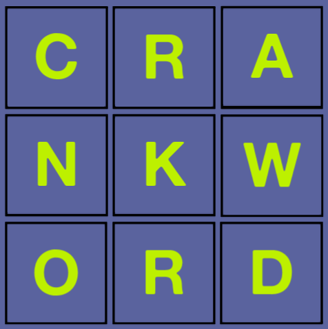

# CRANKWORD

Crankword is a turn-based multiplayer word-guessing game. It's a web application, written in Rust, where login (accounts) are handled by a separate app (crankade).

## TECH:

Crankword uses actix-web for backend, Askama templates for front-end, and sqlx to run the mariadb database.

## USAGE:

You can play the game at https://crankword.crankade.com.